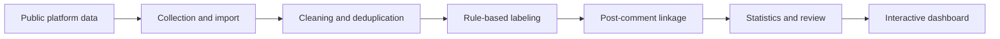

<div align="center">

# AI Social Communication Lens

### How young people use generative AI to speak, connect, and negotiate authenticity

An end-to-end social text research project combining public-data collection,<br>
post-comment linked analysis, interpretable labeling, and an interactive narrative dashboard.

[](https://crazybubbbbbble.github.io/ai-social-communication-analysis/)
[](https://github.com/crazybubbbbbble/ai-social-communication-analysis/actions/workflows/deploy-pages.yml)
[](LICENSE)

</div>

---

## What This Project Studies

Generative AI is becoming a quiet participant in everyday communication: drafting replies, interpreting relationships, softening refusals, composing apologies, and reshaping emotional expression.

This project examines not only **what people post**, but also **how comment sections respond**. Posts and comments remain linked so that support, concern, disagreement, humor, follow-up questions, and practical advice can be studied as one discussion structure.

> The central question is not simply whether people use AI to communicate, but where assistance ends and authorship, authenticity, privacy, and dependence begin.

## Dataset Snapshot

<div align="center">

| Public source records | Analysis-ready records | Platforms | Data relationship |
|:---:|:---:|:---:|:---:|
| **4,545** posts · **18,275** comments | **2,052** posts · **6,354** comments | Weibo · Xiaohongshu | Post ↔ Comment |

</div>

The dashboard currently presents the cleaned, source-filtered dataset generated on **2026-07-06**.

## Explore the Evidence

- **Communication scenes** — relationship advice, reply assistance, emotional expression, formal communication, and companionship.
- **Motivations and strategies** — uncertainty reduction, emotional support, expressive improvement, chat-record upload, and role-play.
- **Risk boundaries** — privacy leakage, authenticity loss, templated “AI tone”, dependence, ethical concerns, and relationship misjudgment.
- **Comment controversy** — how public discussion supports, questions, jokes about, or warns against AI-assisted communication.
- **Evidence archive** — searchable, sortable, and traceable posts and comments instead of chart-only conclusions.

## Research Pipeline



MediaCrawler is used as the primary collector. The repository keeps the reproducible configuration and processing pipeline while excluding login sessions, browser profiles, dependency checkouts, and crawler caches.

## Project Structure

```text
config/              Keywords, schemas, and label dictionaries
scripts/             Collection, cleaning, labeling, statistics, and export
data/raw/            Aggregated crawler exports
data/clean/          Cleaned and labeled post/comment tables
data/stats/          Analysis-ready statistical tables
figures/             Static figures used during validation
reports/             Progress notes and reviewed evidence
docs/                Runbooks and supporting documentation
visualization_app/   React + Vite interactive research dashboard
```

## Built With

`React` · `Vite` · `ECharts` · `D3.js` · `Three.js` · `GSAP` · `Python` · `MediaCrawler`

## Run Locally

```bash
cd visualization_app
npm install
npm run dev
```

Build and verify the production bundle:

```bash
npm run test:selectors
npm run build
```

The dashboard reads its processed dataset from [`visualization_app/public/data/dashboard.json`](visualization_app/public/data/dashboard.json).

## Data Scope

The analysis uses publicly available platform content for academic research. Results describe the collected sample rather than all young people or all platform users. Raw findings should be interpreted alongside platform differences, keyword sampling, missing context, and automated-label uncertainty.

Browser login state, local profiles, virtual environments, third-party source checkouts, and cache snapshots are intentionally excluded from version control.

## License

Code in this repository is released under the [MIT License](LICENSE). Platform content remains subject to its original source and platform terms.
